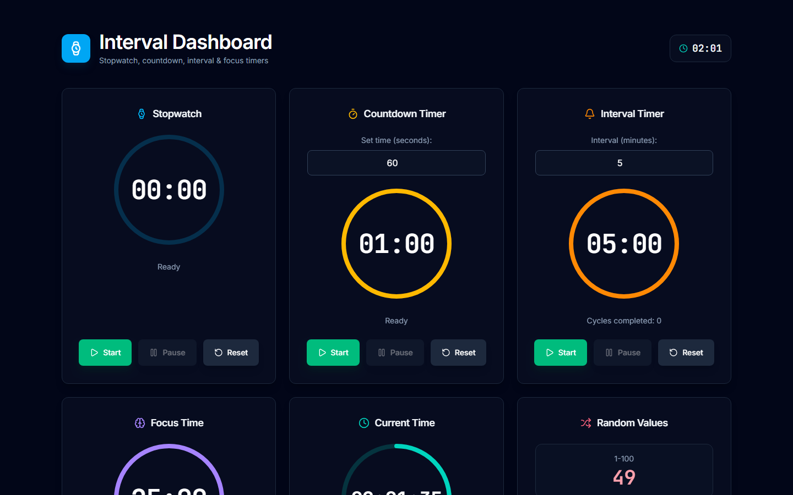

# ⏱️ Interval Dashboard

Een moderne, responsive React-applicatie voor tijdbeheer met verschillende timer functionaliteiten. Gebouwd met Vite, TypeScript en Tailwind CSS voor optimale prestaties en gebruikerservaring.



## ✨ Features

### Timer Functionaliteiten

- **⏱️ Stopwatch**: Klassieke stopwatch voor tijdmeting
- **⏳ Countdown Timer**: Configureerbare afteltimer met alarm
- **🔄 Interval Timer**: Herhalende intervallen met notificaties
- **🍅 Focus Time**: Vaste 25-minuten pomodoro-sessie met sessieteller
- **🕐 Current Time**: Live tijdweergave met minuut-voortgang
- **🎲 Random Values**: Willekeurige getallen (1-100 en 1-200) met "Roll again"-knop

### Gebruikerservaring

- **📱 Fully Responsive**: 1 kolom op mobiel, 2 op tablet, 3 op desktop
- **🌑 Dark Theme**: Donkere slate-achtergrond met subtiele kaarten
- **⭕ Voortgangsringen**: SVG-ringen rond elke tijdweergave met vloeiende transitie
- **🎨 Accentkleuren**: Elke kaart heeft een eigen accentkleur (icoon + ring)
- **⚡ Vite**: Bliksemsnelle development en builds
- **🔧 TypeScript**: Type-safe development
- **🔔 Browser Notifications**: Systeem notificaties voor timers

## 🚀 Live Demo

[🔗 Bekijk de live demo](https://interval-dashboard.vercel.app)

## 🛠️ Tech Stack

- **Frontend Framework**: React 19
- **Build Tool**: Vite
- **Programming Language**: TypeScript
- **Styling**: Tailwind CSS
- **Icons**: Lucide React
- **Package Manager**: npm

## 📋 Prerequisites

- Node.js (versie 20.19 of hoger, bij voorkeur 22 LTS)
- npm

## 🔧 Installatie

1. **Clone de repository**

   ```bash
   git clone https://github.com/HamedSadim1/labo5-interval.git
   cd labo5-interval
   ```

2. **Installeer dependencies**

   ```bash
   npm install
   ```

3. **Start development server**

   ```bash
   npm run dev
   ```

4. **Open in browser**

   [http://localhost:5173](http://localhost:5173)

## 📖 Gebruik

### Stopwatch

- Klik op **Start** om te beginnen met tellen
- Klik op **Stop** om te pauzeren
- Klik op **Reset** om terug te zetten naar 00:00

### Countdown Timer

- Voer de gewenste tijd in seconden in (uitgeschakeld tijdens het lopen)
- Klik op **Start** voor aftellen
- Klik op **Pause** om te pauzeren
- Klik op **Reset** om te herstellen
- Stopt automatisch bij 0

### Interval Timer

- Stel interval tijd in minuten in (uitgeschakeld tijdens het lopen)
- Start voor herhalende notificaties
- Cyclusteller +1 elke keer dat de timer 0 bereikt

### Focus Time

- Vaste 25-minuten pomodoro-sessie
- Cyclusteller telt elke voltooide sessie
- De voortgangsring toont de resterende tijd

### Current Time

- Live kloktijd, elke seconde bijgewerkt
- De ring toont de voortgang binnen de huidige minuut

### Random Values

- Toont willekeurige getallen (1-100 en 1-200)
- Klik op **Roll again** om beide opnieuw te genereren

## 🏗️ Project Structuur

```bash
src/
├── components/           # Herbruikbare UI componenten
│   ├── Button.tsx       # Universele button component
│   ├── Card.tsx         # Slate card container
│   ├── ProgressRing.tsx # SVG voortgangsring
│   ├── TitleWithIcon.tsx # Titel component met icoon
│   ├── TimerControls.tsx # Start/Pause/Reset knoppenrij
│   ├── NumberField.tsx  # Gelabeld getal-invoerveld
│   ├── TimeDisplay.tsx  # Lengte-bewuste cijferweergave
│   ├── StatusLine.tsx   # Statusregel onder de ring
│   ├── TimerCard.tsx    # Gedeelde timerkaart-layout (titel, ring, status, knoppen)
│   ├── Timer.tsx        # Stopwatch component
│   ├── CountdownTimer.tsx # Afteltimer component
│   ├── IntervalTimer.tsx  # Interval timer component
│   ├── PomodoroTimer.tsx  # Focus timer component
│   ├── CurrentTime.tsx    # Live tijd component
│   ├── RandomValue.tsx    # Random generator component
│   ├── Header.tsx         # App header
│   ├── Footer.tsx         # App footer
│   └── DashboardGrid.tsx  # Responsive grid layout
├── hooks/               # Custom React hooks
│   ├── useTimer.ts      # Stopwatch logica
│   ├── useCountdown.ts  # Gedeelde timestamp-gebaseerde aftelbasis
│   ├── useCountdownTimer.ts # Countdown logica
│   ├── useIntervalTimer.ts  # Interval logica
│   └── usePomodoroTimer.ts  # Pomodoro logica
├── utils/               # Utility functies
│   ├── formatTime.ts    # Tijd formatting utility
│   ├── math.ts          # clamp() en progressRatio() helpers
│   └── notifications.ts # Browser notificatie helpers
├── cards.ts             # Single source: kaartlabels, accentkleuren, widgets
├── config.ts            # SSOT: alle constanten & magische waarden (gegroepeerd)
└── App.tsx              # Hoofdcomponent
```

## 🎯 Scripts

```bash
# Development server starten
npm run dev

# Productie build maken
npm run build

# Preview van productie build
npm run preview

# TypeScript type checking
npm run typecheck

# Linting uitvoeren
npm run lint

# Linting automatisch fixen
npm run lint:fix

# Husky git hooks installeren (draait automatisch bij npm install)
npm run prepare
```

## 🛡️ Kwaliteit & CI

Dit project gebruikt geautomatiseerde kwaliteitscontroles:

- **ESLint**: Lint met een flat config (TypeScript + React Hooks + React Refresh)
- **Husky**: Git hooks die automatisch draaien bij elke commit
- **lint-staged**: Lint automatisch de gestagede `.ts`/`.tsx` bestanden bij elke commit
- **Commitlint**: Valideert commit messages volgens Conventional Commits (bijv. `feat: add feature`)
- **GitHub Actions**: CI workflow die typecheck, lint en build draait op elke push en pull request

## 🎨 Design Systeem

### Kleurenpalet

- **Achtergrond**: `bg-slate-950`
- **Kaarten**: `bg-slate-900/40` met `border-slate-800` en `rounded-xl`
- **Accentkleuren per kaart**: Stopwatch = sky-400, Countdown = amber-400, Interval = orange-400, Focus Time = violet-400, Current Time = teal-400, Random Values = rose-400

### Componenten

- **Cards**: Minimale hoogte 384px (`min-h-96`), `rounded-xl`
- **Buttons**: Vaste hoogte 48px (`h-12`), zichtbare focus-ring voor toetsenbord
- **ProgressRing**: SVG met `stroke-dasharray`/`stroke-dashoffset` en `transition` voor vloeiende voortgang
- **Typography**: Inter voor UI, JetBrains Mono voor timers met `tabular-nums`

## 🤝 Bijdragen

Bijdragen zijn welkom! Volg deze stappen:

1. Fork het project
2. Maak een feature branch (`git checkout -b feature/AmazingFeature`)
3. Commit je wijzigingen met een Conventional Commit message (`git commit -m 'feat: add amazing feature'`)
4. Push naar de branch (`git push origin feature/AmazingFeature`)
5. Open een Pull Request

### Development Richtlijnen

- Gebruik TypeScript voor type safety
- Volg de DRY principes (Don't Repeat Yourself)
- Gebruik semantische commit messages
- Test je code voordat je commit

## 📄 Licentie

Dit project is gelicentieerd onder de MIT License - zie het [LICENSE](LICENSE) bestand voor details.

## 🙏 Erkenningen

- [React](https://reactjs.org/) - UI framework
- [Vite](https://vitejs.dev/) - Build tool
- [Tailwind CSS](https://tailwindcss.com/) - Utility-first CSS
- [Lucide React](https://lucide.dev/) - Icon library
- [TypeScript](https://www.typescriptlang.org/) - Programming language

## 📞 Contact

Hamed Sadim

- GitHub: [@HamedSadim1](https://github.com/HamedSadim1)
- Project Link: [https://github.com/HamedSadim1/labo5-interval](https://github.com/HamedSadim1/labo5-interval)

---

⭐ **Geef een ster als je dit project nuttig vindt!** ⭐
